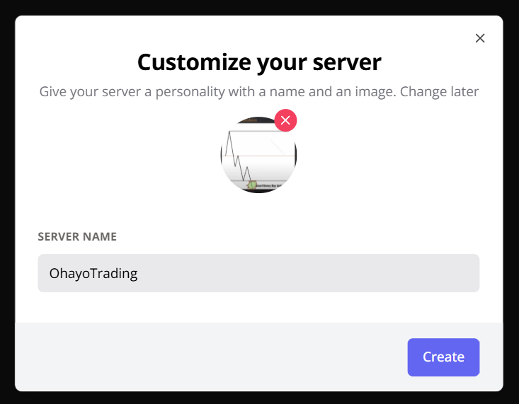
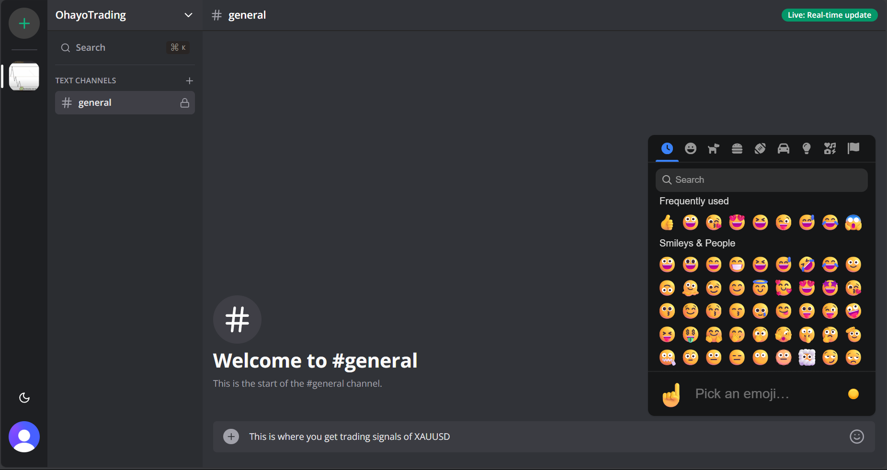
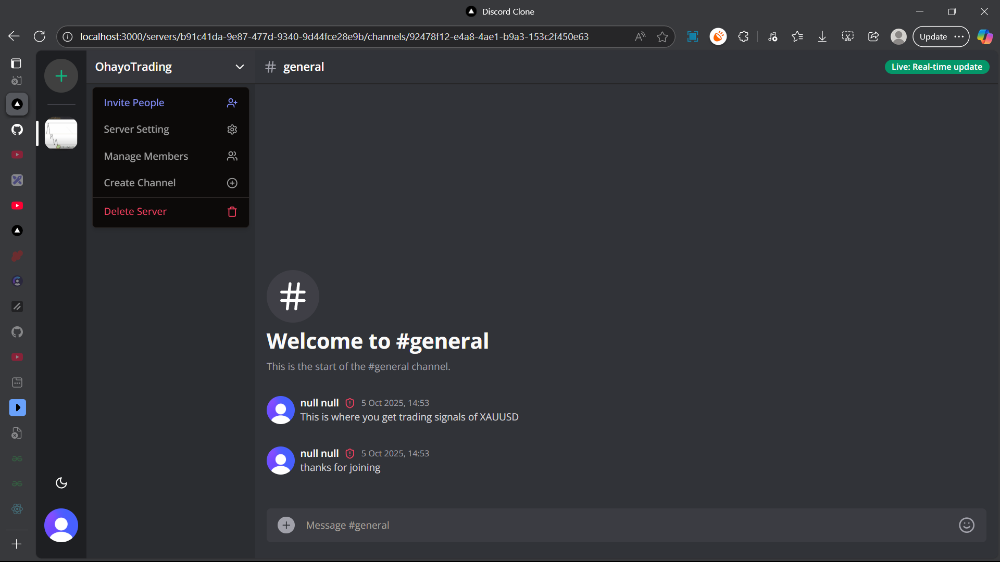
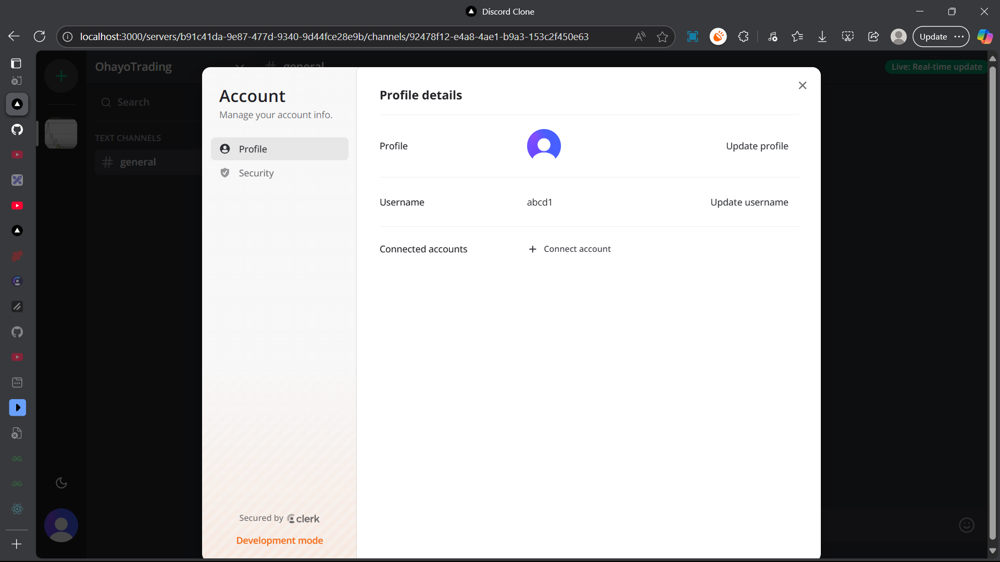

# Discord-Clone
This is a dicord clone created using Next.js and includes:
- text messages
- voice chat
- video calls
<p align="center">
  
  
</p>

<p align="center">
  
  
</p>


## Getting Started

- Clone the repo.
- Get the API keys from clerk, uploadthing and livekit
- Run the development server:
```bash
npm install
npm run dev
```

Open [http://localhost:3000](http://localhost:3000) to visit dicord clone.


## Tech Stack
- Next.js
- React, ReactDOM
- Typescript
- Tailwindcss
- Shadcn
- Socket.io
- Clerk
- Uploadthing
- Livekit
- Other npm packages

## Difficulty
- 6/5 in error solving
- 5/5 implementation
- 5/5 coding
